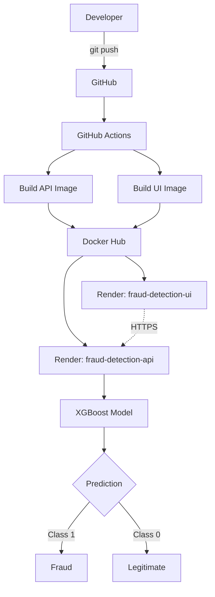
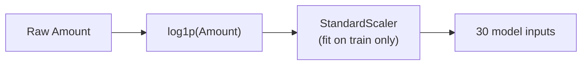
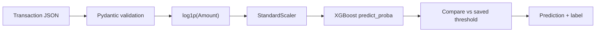
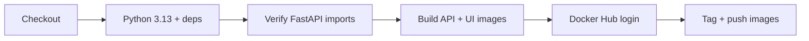

# 💳 Credit Card Fraud Detection — End-to-End ML/MLOps System

<p align="center">
  
  
  
  
  
  
  
  
  
</p>

<p align="center">
  <b>A production-oriented system for detecting fraudulent credit card transactions</b><br/>
  Temporal validation • Imbalanced classification • Threshold optimization • Deep learning benchmarks • Containerized REST API • CI/CD
</p>

---

## Table of Contents

1. [Overview](#1-overview)
2. [Problem Statement & Objective](#2-problem-statement--objective)
3. [Dataset](#3-dataset)
4. [System Architecture](#4-system-architecture)
5. [Data Splitting & Leakage Prevention](#5-data-splitting--leakage-prevention)
6. [Preprocessing](#6-preprocessing)
7. [Model Comparison](#7-model-comparison)
8. [Deep Learning & Extended Experiments](#8-deep-learning--extended-experiments)
9. [Threshold Optimization & Final Model](#9-threshold-optimization--final-model)
10. [Test Performance](#10-test-performance)
11. [Temporal Drift Analysis](#11-temporal-drift-analysis)
12. [MLflow Experiment Tracking](#12-mlflow-experiment-tracking)
13. [Inference Pipeline & API](#13-inference-pipeline--api)
14. [Streamlit Frontend](#14-streamlit-frontend)
15. [Docker, CI/CD & Deployment](#15-docker-cicd--deployment)
16. [Project Structure](#16-project-structure)
17. [Local Setup](#17-local-setup)
18. [Engineering Challenges](#18-engineering-challenges)
19. [Limitations & Future Improvements](#19-limitations--future-improvements)
20. [Screenshots](#20-screenshots)
21. [Author](#21-author)

---

## 1. Overview

This project is a complete ML/MLOps pipeline for credit card fraud detection, not just a notebook. Given a transaction, the system returns:

- **Fraud probability** — the raw model output
- **Decision threshold** — the operational cutoff, stored separately from the model
- **Binary prediction** — `0` or `1`
- **Label** — `Fraud` or `Legitimate`

```
Data → Temporal Split → Preprocessing → Model Comparison (tree models + deep learning)
→ Threshold Optimization → Final XGBoost → MLflow → FastAPI → Docker
→ GitHub Actions → Render → Streamlit UI
```

The goal was **not** to maximize accuracy. With ~0.17% fraud, accuracy is meaningless, so the project is built around recall, precision, PR-AUC, and an explicit false-positive budget.

---

## 2. Problem Statement & Objective

Detect fraudulent transactions from anonymized features, where fraud is extremely rare and a production system must balance **catching fraud** against **flooding reviewers with false alerts**.

> **Objective: maximize fraud recall, subject to at most 10 false positives on the validation set.**

| Challenge | How it is handled |
|---|---|
| Extreme class imbalance (~0.17% fraud) | PR-AUC / precision / recall instead of accuracy |
| Cost asymmetry (missed fraud vs. false alarm) | Explicit `FP ≤ 10` constraint |
| Temporal drift | Chronological split, PSI drift analysis |
| Threshold sensitivity | Threshold tuned on validation, stored as its own artifact |

---

## 3. Dataset

Source: [Kaggle credit card dataset](https://www.kaggle.com/datasets/saurabhbadole/credit-card-dataset).

| Property | Value |
|---|---|
| Transactions | 284,807 |
| Features | `Time`, `V1`–`V28` (anonymized PCA components), `Amount` — 30 total |
| Target | `Class` (0 = legitimate, 1 = fraud) |
| Fraud prevalence | ~0.17% |
| Span | ~48 hours of transactions |

Exact duplicate rows were removed before splitting.

---

## 4. System Architecture



> **Note:** GitHub Actions builds and pushes images to Docker Hub. Render redeploys are done **manually** from the Render dashboard; there is no automated deploy hook.

---

## 5. Data Splitting & Leakage Prevention

A random split would let the model train on future patterns and overstate performance. Instead, the data is **sorted by `Time`** and split into contiguous windows, so the model is always evaluated on transactions later than those it trained on.

```python
df = df.sort_values("Time").reset_index(drop=True)
```

| Split | Rows | Frauds | Time range |
|---|---|---|---|
| Train (70%) | 198,608 | 366 | 0 → 132,906 |
| Validation (15%) | 42,559 | 55 | 132,906 → 151,320 |
| Test (15%) | 42,559 | 52 | 151,320 → 172,792 |

The test set was not used for model selection, threshold tuning, or early stopping.

---

## 6. Preprocessing



`Amount` is log-transformed to reduce skew. The `StandardScaler` is fit on the training set only, then applied unchanged to validation and test data.

---

## 7. Model Comparison

All results are **validation-set**, at the `FP ≤ 10` operating point unless noted.

| Model | PR-AUC | Precision | Recall | FP | FN |
|---|---|---|---|---|---|
| **Final XGBoost, early stopping (selected)** | **0.885** | 0.857 | **0.873** | 8 | 7 |
| Tuned XGBoost | 0.877 | 0.839 | 0.855 | 9 | 8 |
| Weighted ensemble (XGB 0.8 / RF 0.1 / CatBoost 0.1) | 0.876 | 0.938 | 0.818 | 3 | 10 |
| H2O AutoML (XRT leader) | 0.854 | 0.865 | 0.818 | 7 | 10 |
| XGBoost baseline | 0.859 | 0.978† | 0.818† | 1† | 10† |
| CatBoost | 0.855 | 1.000† | 0.800† | 0† | 11† |
| Random Forest | 0.856 | 1.000† | 0.764† | 0† | 13† |
| Weighted Logistic Regression | 0.814 | 0.905† | 0.691† | – | – |
| Logistic Regression | 0.750 | 0.691† | 0.855† | 21† | 8† |
| LightGBM (untuned, default 0.5 threshold) | 0.392 | 0.254 | 0.582 | 94 | 23 |

<sub>† Best-F1 threshold rather than the `FP ≤ 10` rule, so not directly comparable on recall.</sub>

**Why the weighted ensemble lost:** it had higher precision and fewer false positives, but XGBoost caught more fraud (48 vs. 45 of 55), which is what the objective prioritizes. This is a deliberate trade-off, not a claim that the ensemble is worse in general.

---

## 8. Deep Learning & Extended Experiments

A second round of experiments tested whether neural networks, unsupervised anomaly detection, blending, or resampling could beat the final XGBoost model.

**Setup (same for all neural nets):** TensorFlow/Keras 2.20 on CPU, same 30 preprocessed features, Adam (`lr=1e-3`), batch size 512, up to 50 epochs, early stopping on validation PR-AUC (patience 8), `ReduceLROnPlateau`, and the same `FP ≤ 10` threshold search on validation.

### 8.1 Neural networks and autoencoder

| Experiment | Architecture | Loss | Params | Best epoch | Val PR-AUC |
|---|---|---|---|---|---|
| MLP | 64 → 32 → 16 → 1, Dropout 0.30 / 0.20 | BCE + class weights (fraud ≈ 271×) | 4,609 | 3 | 0.852 |
| MLP + BatchNorm | 64 → 32 → 16 → 1, BatchNorm + Dropout | Focal loss (α = 0.75, γ = 2) | 5,057 | 14 | 0.861 |
| Autoencoder | 30 → 16 → 8 → 16 → 30, trained on legitimate rows only | MSE | 1,286 | 44 | – |

The autoencoder **detected 0 of 55 frauds** within the false-positive budget. Legitimate transactions have a heavy reconstruction-error tail (max 146.7), so any threshold that stays within the budget sits above every fraud example. It was not evaluated on test.

### 8.2 Other strategies (XGBoost-based)

| Strategy | Val PR-AUC | Recall | FP | Outcome |
|---|---|---|---|---|
| XGBoost + 10% focal-loss NN blend (best of 5 weightings) | 0.883 | 0.855 | 10 | No gain over XGBoost alone |
| SMOTE / SMOTETomek (`sampling_strategy=0.1`) | 0.854 | 0.782 | 7 | Identical results; worse than no resampling |
| Random undersampling (10:1) | 0.841 | 0.782 | 10 | Worse than no resampling |
| *Reference: tuned XGBoost, no resampling* | *0.868* | *0.855* | *7* | – |

### 8.3 Test-set comparison

Thresholds were fixed on validation. The neural nets were scored on test **after** the production XGBoost model was frozen; the numbers are for comparison only and did not influence selection.

| Model | Precision | Recall | F1 | ROC-AUC | PR-AUC | FP | FN |
|---|---|---|---|---|---|---|---|
| **Final XGBoost (production)** | 0.765 | 0.750 | 0.757 | 0.973 | 0.762 | 12 | 13 |
| MLP + class weights | 0.837 | 0.692 | 0.758 | 0.983 | 0.769 | 7 | 16 |
| MLP + BatchNorm + focal loss | 0.867 | 0.750 | 0.804 | 0.937 | 0.759 | 6 | 13 |

### 8.4 Takeaways

- **On validation, XGBoost led on the objective:** 48 of 55 frauds caught, versus 43 for both neural networks.
- **On test, the picture is mixed.** The focal-loss network matched XGBoost's recall with half the false positives (6 vs. 12), but had a lower ROC-AUC. With only 52 test frauds, one transaction moves recall by ~1.9 points, so these gaps are within noise.
- **XGBoost was kept because the selection rule was fixed in advance**, and it avoids adding a TensorFlow dependency and a custom loss function to the serving image.
- **The focal-loss network is the most promising deep learning candidate** for future work.
- **Caveat:** no TensorFlow seed was set, so neural-net results come from a single run. Their raw probabilities are also not calibrated, which matters for blending.

---

## 9. Threshold Optimization & Final Model

The threshold for each candidate was chosen on the validation set to **maximize recall with at most 10 false positives**.

**Final model:** XGBoost with early stopping on validation PR-AUC.

```python
XGBClassifier(
    n_estimators=1500, max_depth=6, learning_rate=0.05,
    subsample=0.9, colsample_bytree=0.9, min_child_weight=3, gamma=0.1,
    reg_alpha=0, reg_lambda=1, objective="binary:logistic",
    eval_metric="aucpr", random_state=42, early_stopping_rounds=50,
)
```

| Item | Value |
|---|---|
| Best iteration | 100 |
| Validation PR-AUC | 0.8855 |
| **Decision threshold** | **0.09133733808994293** |
| Validation precision / recall | 0.857 / 0.873 |
| Validation FP / FN / TP | 8 / 7 / 48 |

The threshold is saved as a **separate artifact** from the model, so the decision boundary can be changed without retraining.

---

## 10. Test Performance

| | Predicted Legitimate | Predicted Fraud |
|---|---|---|
| **Actual Legitimate** | 42,495 (TN) | 12 (FP) |
| **Actual Fraud** | 13 (FN) | 39 (TP) |

| Metric | Validation | **Test** |
|---|---|---|
| Precision | 0.857 | **0.765** |
| Recall | 0.873 | **0.750** |
| F1 | 0.865 | **0.757** |
| PR-AUC | 0.885 | **0.762** |
| ROC-AUC | 0.984 | **0.973** |

> ⚠️ **The test column is the realistic estimate.** Validation was also used for early stopping and threshold selection, and the test period is distributionally different (Section 11), so a drop is expected and honest.

---

## 11. Temporal Drift Analysis

The Population Stability Index (PSI) between train and test shows substantial shift in several features (PSI > 0.25 is substantial):

| Feature | PSI |
|---|---|
| `Time` | 8.28 |
| `V1` | 1.01 |
| `V3` | 0.75 |
| `V28` | 0.53 |
| `V11` | 0.34 |
| `V25` | 0.29 |

The model's most important features (`V10`, `V14`) shifted little (PSI 0.03 and 0.08), and the most-drifted features are not its main drivers. So **drift alone does not explain the test drop**; label sparsity (52 frauds) and shifting feature–fraud relationships may also contribute. The practical conclusion is to **monitor for drift after deployment**.

---

## 12. MLflow Experiment Tracking

| Field | Value |
|---|---|
| Experiment | `Credit Card Fraud Detection` |
| Final run | `Final_EarlyStopping_XGBoost` (`05fdce93dde24316a80be71dd2d9f67c`) |
| Registered model | `CreditCardFraudXGBoost`, version `1`, status `READY` |

The run logs hyperparameters, the decision threshold, validation and test metrics, and the model artifact with an inferred signature.

---

## 13. Inference Pipeline & API



**Artifacts loaded by the API (`models/`):**

| File | Purpose |
|---|---|
| `final_fraud_xgboost_model.json` | XGBoost model, native JSON format |
| `final_fraud_scaler.pkl` | `StandardScaler` fit on training data |
| `final_fraud_threshold.pkl` | Operational decision threshold |

**Endpoints:**

| Method | Endpoint | Description |
|---|---|---|
| `GET` | `/health` | Service and model status |
| `POST` | `/predict` | Fraud inference for one transaction |
| `GET` | `/docs` | Swagger / OpenAPI UI |

**Example request** (abbreviated; send all of `Time`, `V1`–`V28`, `Amount`):

```bash
curl -X POST "https://<render-api-host>/predict" \
  -H "Content-Type: application/json" \
  -d '{"Time": 406, "V1": -2.3122, "V2": 1.9519, "...": "...", "V28": -0.1433, "Amount": 0.0}'
```

**Example response:**

```json
{
  "fraud_probability": 0.9572,
  "threshold": 0.0913,
  "prediction": 1,
  "prediction_label": "Fraud"
}
```

---

## 14. Streamlit Frontend

A Streamlit app calls the FastAPI service over HTTPS so the model can be used without crafting HTTP requests.

- Live API health indicator and model name/version panel
- Inputs for `Time`, `Amount`, and `V1`–`V28`
- **Load Fraud Example**, **Load Demo Transaction**, and **Analyze Transaction** buttons
- Result panel showing fraud probability and label

---

## 15. Docker, CI/CD & Deployment

### Docker

Two independent images, both on `python:3.13-slim`:

| Image | Contents | Tag |
|---|---|---|
| `kashish1303/fraud-detection-api` | FastAPI + Uvicorn + model artifacts | `1.2` |
| `kashish1303/fraud-detection-ui` | Streamlit app | `1.1` |

The legacy pickle model is excluded from images and Git via `.dockerignore` and `.gitignore`.

### CI/CD

**Workflow:** `Fraud Detection CI/CD`, triggered on push and pull requests to `main`.



Required repository secrets: `DOCKERHUB_USERNAME`, `DOCKERHUB_TOKEN`.

### Deployment (Render)

1. Push to `main`; GitHub Actions pushes updated images to Docker Hub.
2. In the Render dashboard, manually redeploy `fraud-detection-api` and `fraud-detection-ui` (each pulls `:latest`).
3. Verify `/health` and `/docs` on the API, and that the UI shows `API Online`.

The deployed API and UI were manually verified end-to-end on both fraud and legitimate examples.

---

## 16. Project Structure

```
Fraud Detection/
├── app.py                  # FastAPI app: endpoints, schemas, inference logic
├── streamlit_app.py        # Streamlit frontend
├── Dockerfile              # API image
├── Dockerfile.ui           # UI image
├── requirements.txt        # Pinned dependencies
├── .dockerignore / .gitignore
├── models/
│   ├── final_fraud_xgboost_model.json
│   ├── final_fraud_scaler.pkl
│   └── final_fraud_threshold.pkl
└── .github/workflows/ci-cd.yml
```

---

## 17. Local Setup

```bash
git clone https://github.com/KashishPundir/CreditCard-Fraud-Detection.git
cd CreditCard-Fraud-Detection

python -m venv venv
source venv/bin/activate        # Windows: venv\Scripts\activate
pip install -r requirements.txt

uvicorn app:app --reload --port 8000    # API → http://localhost:8000/docs
streamlit run streamlit_app.py          # UI  → http://localhost:8501
```

**With Docker:**

```bash
docker build -t fraud-detection-api -f Dockerfile .
docker build -t fraud-detection-ui  -f Dockerfile.ui .
docker network create fraud-network
docker run -d --name fraud-api --network fraud-network -p 8000:8000 fraud-detection-api
docker run -d --name fraud-ui  --network fraud-network -p 8501:8501 fraud-detection-ui
```

**Reproducing the modeling:** sort by `Time`, apply the 70/15/15 split, fit `log1p` + `StandardScaler` on train only, train candidates, select thresholds under `FP ≤ 10`, then train the final model with the Section 9 configuration. Seeds are fixed (`random_state=42`, H2O `seed=42`) except for TensorFlow (see Section 8.4).

---

## 18. Engineering Challenges

**1. Pickle serialization failure.** The pickled XGBoost model loaded in Colab but raised `XGBoostError: input stream corrupted` on local Windows, even though the file's SHA-256 matched exactly, so the file was intact and the problem was environment-specific deserialization. *Fix:* switch to XGBoost's native JSON format (`save_model` / `load_model`).

**2. Localhost in the cloud.** The UI called the API at `127.0.0.1:8000`, which worked locally but broke on Render because `localhost` there is the UI container itself. *Fix:* point the deployed UI at the API's public HTTPS endpoint.

**3. Separating model from decision.** Persisting the model, scaler, and threshold as independent artifacts lets the operating point change without retraining.

**4. Frontend/backend separation.** Streamlit and FastAPI run as two independent services, so each can be scaled and redeployed on its own.

---

## 19. Limitations & Future Improvements

**Limitations**

- Only 52 frauds in the test set, so metrics are noisy.
- Test performance (recall 0.75, precision 0.76) is clearly below validation, and drift is present.
- Neural-net results come from a single unseeded run.
- Verified at demonstration scale only: no load testing, no authentication, no real financial data.

**Future improvements**

- Automated API and schema tests in CI (currently only an import check and image builds)
- Automated deployment from GitHub Actions to Render
- Drift monitoring on production inputs
- Multi-seed evaluation and probability calibration of the focal-loss network
- API authentication before any non-demo use

---

## 20. Screenshots

| View | Screenshot |
|---|---|
| Streamlit UI — Home | [screenshots/ui-home.png](screenshots/ui-home.png) |
| Streamlit UI — Fraud (input) | [screenshots/ui-fraud-result-input.png](screenshots/ui-fraud-result-input.png) |
| Streamlit UI — Fraud (output) | [screenshots/ui-fraud-result-output.png](screenshots/ui-fraud-result-output.png) |
| Streamlit UI — Legitimate | [screenshots/ui-legit-result.png](screenshots/ui-legit-result.png) |
| FastAPI Swagger Docs | [screenshots/api-swagger.png](screenshots/api-swagger.png) |
| MLflow Run | [screenshots/mlflow-run.png](screenshots/mlflow-run.png) |
| Render Deployment | [screenshots/render-deployment.png](screenshots/render-deployment.png) |

---

## 21. Author

**Kashish Pundir**
GitHub: [KashishPundir/CreditCard-Fraud-Detection](https://github.com/KashishPundir/CreditCard-Fraud-Detection)

---

<p align="center"><i>A demonstration of an end-to-end ML/MLOps workflow. Functionally verified end-to-end; not tested at production transaction volume and does not process real financial data.</i></p>
