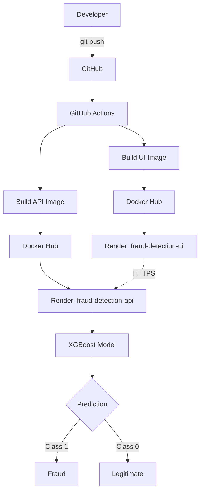
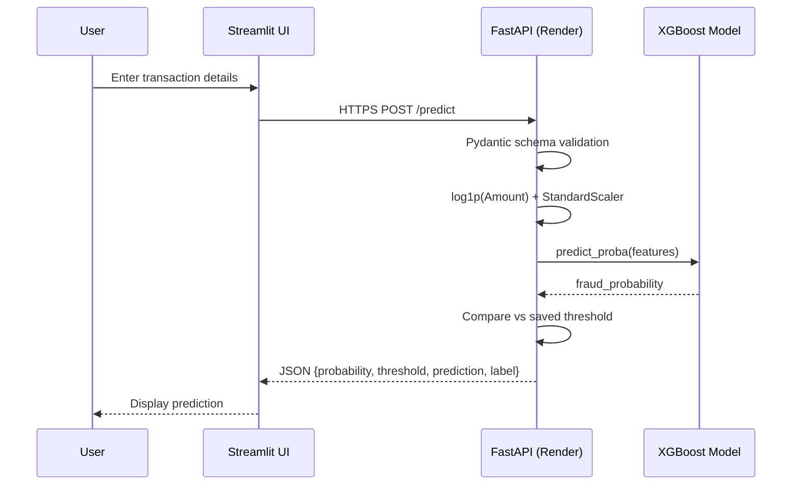
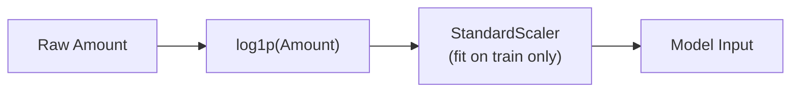
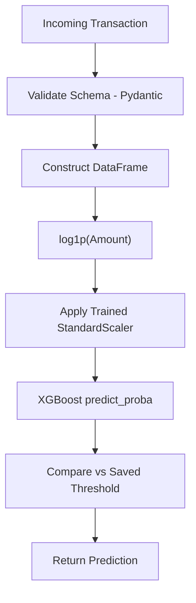
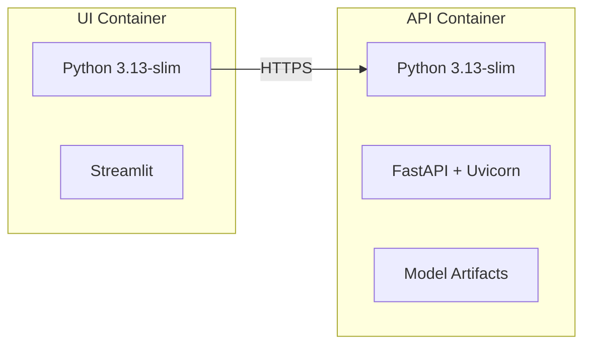
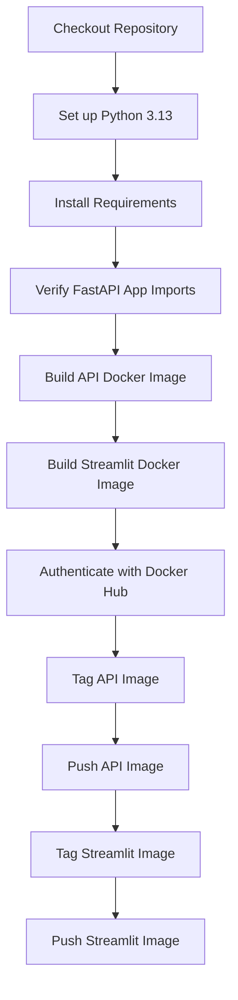

# 💳 Credit Card Fraud Detection — End-to-End ML/MLOps System

<p align="center">
  
  
  
  
  
  
  
  
</p>

<p align="center">
  <b>A production-oriented machine learning engineering system for detecting fraudulent credit card transactions</b><br/>
  Temporal validation • Imbalanced classification • Threshold optimization • Experiment tracking • Containerized REST API • CI/CD • Cloud deployment
</p>

---

## Table of Contents

1. [Overview](#1-overview)
2. [Problem Statement](#2-problem-statement)
3. [Why Fraud Detection Is Difficult](#3-why-fraud-detection-is-difficult)
4. [Key Objectives](#4-key-objectives)
5. [System Architecture](#5-system-architecture)
6. [ML Pipeline](#6-ml-pipeline)
7. [Dataset](#7-dataset)
8. [Data Leakage Prevention](#8-data-leakage-prevention)
9. [Preprocessing](#9-preprocessing)
10. [Model Development](#10-model-development)
11. [Model Comparison](#11-model-comparison)
12. [Threshold Optimization](#12-threshold-optimization)
13. [Final Model](#13-final-model)
14. [Test Performance](#14-test-performance)
15. [MLflow Experiment Tracking](#15-mlflow-experiment-tracking)
16. [Production Inference Pipeline](#16-production-inference-pipeline)
17. [FastAPI Backend](#17-fastapi-backend)
18. [Streamlit Frontend](#18-streamlit-frontend)
19. [Docker Architecture](#19-docker-architecture)
20. [CI/CD Pipeline](#20-cicd-pipeline)
21. [Docker Hub](#21-docker-hub)
22. [Render Deployment](#22-render-deployment)
23. [Project Structure](#23-project-structure)
24. [API Documentation](#24-api-documentation)
25. [Example API Request](#25-example-api-request)
26. [Example API Response](#26-example-api-response)
27. [Testing Strategy](#27-testing-strategy)
28. [Engineering Challenges](#28-engineering-challenges)
29. [Reproducibility](#29-reproducibility)
30. [Future Improvements](#30-future-improvements)
31. [Screenshots](#31-screenshots)
32. [Local Setup](#32-local-setup)
33. [Docker Setup](#33-docker-setup)
34. [CI/CD Setup](#34-cicd-setup)
35. [Deployment](#35-deployment)
36. [Lessons Learned](#36-lessons-learned)
37. [Author](#37-author)

---

## 1. Overview

This project implements a **credit card fraud detection system** as a complete ML/MLOps pipeline — not just a notebook exercise. Given transaction-level data, the system returns:

- **Fraud probability** — the raw model output
- **Configured decision threshold** — the operational cutoff used to convert probability into a decision
- **Binary prediction** — `0` or `1`
- **Human-readable label** — `Fraud` or `Legitimate`

The system spans the full lifecycle from raw data to a live, containerized, cloud-deployed inference service:

```
Data → Temporal Split → Preprocessing → Model Development → Model Comparison
→ Threshold Optimization → Final XGBoost Model → MLflow Tracking
→ Model Serialization → FastAPI → Docker → Docker Hub
→ GitHub Actions CI/CD → Render Deployment → Streamlit UI → Live Prediction
```

The objective was **not** to maximize raw accuracy. Because fraud is an extreme minority class, the project is built around recall, precision, F1, PR-AUC, and an explicit operational constraint on false positives.

---

## 2. Problem Statement

Detect fraudulent credit card transactions from anonymized transaction-level features, where fraud represents a very small fraction of all transactions, and where a production system must balance **catching fraud** against **not overwhelming operations with false alerts**.

## 3. Why Fraud Detection Is Difficult

| Challenge | Description |
|---|---|
| **Extreme class imbalance** | Fraud accounts for ~0.17% of transactions — a naive classifier that predicts "legitimate" for everything would be >99.8% "accurate" while catching zero fraud. |
| **Cost asymmetry** | Missing fraud (false negative) and raising false alarms (false positive) carry very different operational costs. |
| **Temporal drift** | Transaction patterns evolve over time; a model must generalize to *future* transactions, not just unseen rows from the same time window. |
| **Anonymized features** | V1–V28 provide no direct interpretability, requiring the model to learn purely from statistical structure. |
| **Threshold sensitivity** | The default 0.5 probability cutoff is rarely the right operational decision boundary for imbalanced problems. |

## 4. Key Objectives

- Build a fraud classifier optimized for **recall under a false-positive budget**, not raw accuracy
- Prevent temporal and preprocessing data leakage through disciplined validation design
- Track experiments reproducibly with **MLflow**
- Serialize models robustly across environments
- Expose predictions through a documented **REST API**
- Provide a usable **UI** for non-technical interaction with the model
- Containerize and deploy the system through a **CI/CD pipeline** to the cloud

---

## 5. System Architecture

### High-Level Deployment Architecture



### Request-Level Architecture



> **Note:** GitHub Actions currently builds and pushes Docker images to Docker Hub. Render is the configured deployment target, but the Render services were manually (re)deployed from the Render dashboard during this implementation — there is **no automated deployment hook** from GitHub Actions to Render at this time.

---

## 6. ML Pipeline

```mermaid
flowchart LR
    A[Raw Dataset\n284,807 txns] --> B[Sort by Time]
    B --> C[Temporal Split\n70/15/15]
    C --> D[Preprocessing\nlog1p + StandardScaler]
    D --> E[Model Development\n8 approaches evaluated]
    E --> F[Threshold Optimization\nFP <= 10]
    F --> G[Final XGBoost\nEarly Stopping]
    G --> H[MLflow Tracking\n+ Model Registry]
    H --> I[JSON Serialization]
    I --> J[FastAPI Inference Service]
```



---

## 7. Dataset

| Property | Value |
|---|---|
| Total transactions | 284,807 |
| Features | `Time`, `V1`–`V28` (anonymized/PCA-transformed), `Amount` |
| Target | `Class` (0 = legitimate, 1 = fraud) |
| Fraud prevalence | ~0.1727% |
| Feature count used by final model | 30 (`Time`, `V1`–`V28`, `Amount`) |

The extreme imbalance is the central reason this project evaluates models using **PR-AUC, precision, recall, and F1** rather than accuracy, and why threshold optimization is treated as a first-class step rather than an afterthought.

---

## 8. Data Leakage Prevention

A random train/test split was deliberately avoided. Instead, the dataset was **sorted chronologically by `Time`** and split into contiguous windows so that the model is always evaluated on transactions that occur *after* the ones it was trained on — mirroring how a production fraud model actually operates.

```python
df = df.sort_values("Time").reset_index(drop=True)
```

| Split | Rows | Fraud Count | Time Range |
|---|---|---|---|
| Training | 198,608 | 366 | 0 → 132,906 |
| Validation | 42,559 | 55 | 132,906 → 151,320 |
| Test | 42,559 | 52 | 151,320 → 172,792 |

**Split ratio:** 70% train / 15% validation / 15% test.

The test set was held out entirely from model selection and threshold tuning and was evaluated exactly once, at the end.

---

## 9. Preprocessing



- `Amount` is transformed with `np.log1p(Amount)` to reduce skew.
- A `StandardScaler` is **fit only on the training set**, then applied unchanged to validation and test data — preventing information from validation/test distributions from leaking into training.
- Final input feature set: `Time`, `V1`–`V28`, `Amount` (30 features).

---

## 10. Model Development

Eight modeling approaches were evaluated to compare baseline linear models against tree-based ensembles and an AutoML benchmark:

1. Logistic Regression
2. Weighted Logistic Regression
3. Random Forest
4. XGBoost (baseline)
5. LightGBM
6. CatBoost
7. Weighted XGBoost / Random Forest / CatBoost ensemble
8. H2O AutoML

---

## 11. Model Comparison

All metrics below are **validation-set** results.

<details>
<summary><b>Logistic Regression</b></summary>

| Metric | Default Threshold | Optimized Threshold |
|---|---|---|
| Precision | — | 0.6912 |
| Recall | — | 0.8545 |
| F1 | 0.6000 | 0.7642 |
| PR-AUC | 0.7498 | — |

</details>

<details>
<summary><b>Weighted Logistic Regression</b></summary>

| Metric | Default Threshold | Optimized Threshold |
|---|---|---|
| Precision | 0.0483 | 0.9048 |
| Recall | 0.9273 | 0.6909 |
| F1 | 0.0918 | 0.7835 |

</details>

<details>
<summary><b>Random Forest (200 trees)</b></summary>

| Metric | Default Threshold | Best F1 Threshold (0.405) |
|---|---|---|
| Precision | 1.0000 | 1.0000 |
| Recall | 0.6909 | 0.7636 |
| F1 | 0.8172 | 0.8660 |
| PR-AUC | 0.8555 | — |

</details>

<details>
<summary><b>XGBoost (initial baseline)</b></summary>

Configuration: `n_estimators=300, max_depth=6, learning_rate=0.05, subsample=0.8, colsample_bytree=0.8`

| Metric | Default Threshold | Best F1 Threshold (0.2193) |
|---|---|---|
| Precision | 0.9762 | 0.9783 |
| Recall | 0.7455 | 0.8182 |
| F1 | 0.8454 | 0.8911 |
| ROC-AUC | 0.9854 | — |
| PR-AUC | 0.8587 | — |

</details>

<details>
<summary><b>H2O AutoML (XRT leader model)</b></summary>

Configuration: `H2O 3.46.0.12, max_models=10, seed=42, sort_metric=AUCPR, nfolds=0`, temporal validation.

| Metric | Value (under FP ≤ 10, threshold 0.22) |
|---|---|
| Validation PR-AUC | 0.8536 |
| Precision | 0.8654 |
| Recall | 0.8182 |
| FP / FN / TP | 7 / 10 / 45 |

</details>

### Summary Comparison (validation set)

| Model | PR-AUC | Best Precision | Best Recall | Best F1 |
|---|---|---|---|---|
| Logistic Regression | 0.7498 | 0.6912 | 0.8545 | 0.7642 |
| Weighted Logistic Regression | — | 0.9048 | 0.6909 | 0.7835 |
| Random Forest | 0.8555 | 1.0000 | 0.7636 | 0.8660 |
| XGBoost (baseline) | 0.8587 | 0.9783 | 0.8182 | 0.8911 |
| H2O AutoML (XRT) | 0.8536 | 0.8654 | 0.8182 | — |
| **Tuned XGBoost (FP ≤ 10)** | **0.8773** | 0.8393 | 0.8545 | — |
| Weighted Ensemble (XGB/RF/CatBoost, FP ≤ 10) | 0.8763 | 0.9375 | 0.8182 | — |
| **Final Early-Stopping XGBoost (selected)** | **0.8855** | 0.8571 | 0.8727 | — |

> Model selection was **not** based on picking the single-highest metric in isolation. It was driven by the project's predefined operational objective (Section 12).

---

## 12. Threshold Optimization

Rather than optimizing for accuracy or an unconstrained F1 score, the project defined an explicit operational objective:

> **Maximize fraud recall, subject to a maximum acceptable number of false positives.**

```python
MAX_FALSE_POSITIVES = 10
```

This reflects a realistic fraud-operations trade-off: missing fraud is costly, but flooding a review queue with false alarms is also operationally expensive.

**Tuned XGBoost under FP ≤ 10:**

| Threshold | Precision | Recall | FP | FN | TP | TN |
|---|---|---|---|---|---|---|
| 0.048321 | 0.8393 | 0.8545 | 9 | 8 | 47 | 42,497 |

**Ensemble (XGBoost 0.8 / RF 0.1 / CatBoost 0.1) under FP ≤ 10:**

| Threshold | Precision | Recall | FP | FN | TP |
|---|---|---|---|---|---|
| 0.10605 | 0.9375 | 0.8182 | 3 | 10 | 45 |

The weighted ensemble achieved higher precision with fewer false positives, but the manually tuned XGBoost model was retained because it delivered **higher recall**, which was prioritized under the project's stated objective. This is a deliberate trade-off, not a claim that XGBoost is universally superior to the ensemble.

---

## 13. Final Model

The production model is an **XGBoost classifier trained with early stopping**.

```python
XGBClassifier(
    n_estimators=1500,
    max_depth=6,
    learning_rate=0.05,
    subsample=0.9,
    colsample_bytree=0.9,
    min_child_weight=3,
    gamma=0.1,
    reg_alpha=0,
    reg_lambda=1,
    objective="binary:logistic",
    eval_metric="aucpr",
    random_state=42,
    early_stopping_rounds=50,
)
```

- Early stopping was driven by the **validation set**.
- **Best iteration:** 100
- **Validation PR-AUC:** 0.885475

### Final Decision Threshold

```
threshold = 0.09133733808994293
```

Selected on the validation set according to the recall/false-positive operational objective, and **saved as a separate artifact from the model** — the probability a classifier emits and the operational decision boundary applied to it are treated as distinct concerns.

**Validation performance at this threshold:**

| Metric | Value |
|---|---|
| Precision | 0.8571 |
| Recall | 0.8727 |
| False Positives | 8 |
| False Negatives | 7 |
| True Positives | 48 |
| True Negatives | 42,496 |

---

## 14. Test Performance

The test set — the chronologically final 15% of transactions — was held out during all model and threshold selection and evaluated **exactly once**.

**Test confusion matrix:**

| | Predicted Legitimate | Predicted Fraud |
|---|---|---|
| **Actual Legitimate** | 42,495 (TN) | 12 (FP) |
| **Actual Fraud** | 13 (FN) | 39 (TP) |

**Test metrics:**

| Metric | Value |
|---|---|
| Precision | 0.7647 |
| Recall | 0.7500 |
| F1 | 0.7573 |
| ROC-AUC | 0.9730 |
| PR-AUC | 0.7620 |

### ⚠️ Validation vs. Test — Read This Carefully

Validation metrics (Section 13) and final test metrics **are not the same thing and should not be conflated**. The test set represents later, previously unseen transactions that were never touched during model or threshold selection, so some degradation relative to validation performance is expected and is a normal, honest signature of temporal generalization — not a modeling error. **The test metrics above, not the validation metrics, represent the model's realistic held-out performance.**

---

## 15. MLflow Experiment Tracking

| Field | Value |
|---|---|
| Experiment name | `Credit Card Fraud Detection` |
| Final run name | `Final_EarlyStopping_XGBoost` |
| Run ID | `05fdce93dde24316a80be71dd2d9f67c` |
| Registered model name | `CreditCardFraudXGBoost` |
| Registered version | `1` |
| Status | `READY` |

The final MLflow run logs:

- Model hyperparameters and early-stopping configuration
- The selected decision threshold
- Validation and test metrics
- Serialized model artifacts

---

## 16. Production Inference Pipeline



**Model artifacts used at inference time:**

| File | Purpose |
|---|---|
| `final_fraud_xgboost_model.json` | Trained XGBoost model, native JSON format |
| `final_fraud_scaler.pkl` | `StandardScaler` fitted on training data |
| `final_fraud_threshold.pkl` | Final operational decision threshold |

**Example: fraudulent transaction**

```json
{
  "fraud_probability": 0.9572089910507202,
  "threshold": 0.09133733808994293,
  "prediction": 1,
  "prediction_label": "Fraud"
}
```

**Example: legitimate transaction**

```json
{
  "fraud_probability": 0.00002283489993715193,
  "threshold": 0.09133733808994293,
  "prediction": 0,
  "prediction_label": "Legitimate"
}
```

---

## 17. FastAPI Backend

The inference service is implemented in **FastAPI**.

| Method | Endpoint | Description |
|---|---|---|
| `GET` | `/health` | Service and model status |
| `POST` | `/predict` | Runs inference on a transaction payload |
| `GET` | `/docs` | Interactive Swagger / OpenAPI documentation |

**Health check response:**

```json
{
  "status": "healthy",
  "model": "CreditCardFraudXGBoost",
  "version": "1"
}
```

The deployed API was manually exercised through the Swagger UI with real request payloads covering both fraud and legitimate cases.

---

## 18. Streamlit Frontend

A **Streamlit** application provides a UI on top of the FastAPI service so the model can be exercised without crafting raw HTTP requests.

**UI components:**

- Title: *Credit Card Fraud Detection*
- Live API health indicator
- Transaction `Time` input
- Transaction `Amount` input
- `V1`–`V28` advanced feature inputs
- **Load Fraud Example** button
- **Load Demo Transaction** button
- **Analyze Transaction** button
- Prediction results panel (fraud probability + prediction label)
- Model information panel (`CreditCardFraudXGBoost`, version)

The Streamlit app communicates with the deployed FastAPI service exclusively over **HTTPS**. In manual end-to-end testing, the production UI correctly displayed `API Online`, `CreditCardFraudXGBoost`, `Version 1`, and returned correct predictions for both fraud and legitimate examples.

---

## 19. Docker Architecture

The project builds **two independent Docker images** — one per service.



| Image | Base | Contents |
|---|---|---|
| `kashish1303/fraud-detection-api` | `python:3.13-slim` | FastAPI app + Uvicorn + model artifacts |
| `kashish1303/fraud-detection-ui` | `python:3.13-slim` | Streamlit app |

Model artifacts (`final_fraud_xgboost_model.json`, `final_fraud_scaler.pkl`, `final_fraud_threshold.pkl`) are copied directly into the API image. The legacy XGBoost **pickle** model file is explicitly excluded via `.dockerignore` and `.gitignore` (see Section 28).

### Local Docker Networking

For local container-to-container testing, both services were connected via a dedicated Docker network:

| Service | Network | Exposed Port |
|---|---|---|
| API | `fraud-network` | `8000` |
| Streamlit | `fraud-network` | `8501` |

For cloud deployment, the Streamlit service was reconfigured to call the **public Render API HTTPS endpoint** instead of the internal Docker service name.

---

## 20. CI/CD Pipeline

**Workflow name:** `Fraud Detection CI/CD`

**Triggers:**
- `push` to `main`
- `pull_request` targeting `main`



Docker Hub credentials are stored as **GitHub Actions secrets** (`DOCKERHUB_USERNAME`, `DOCKERHUB_TOKEN`) and are never exposed in source or documentation. The workflow has been successfully executed through GitHub Actions.

> **Deployment nuance:** this pipeline builds and pushes Docker images to Docker Hub — it does **not** automatically trigger a Render deployment. Render deployment in this project is a manual step performed from the Render dashboard after new images are pushed.

---

## 21. Docker Hub

| Image | Tag | Digest |
|---|---|---|
| `kashish1303/fraud-detection-api` | `1.2` | `sha256:373633731761ce0900dd55e088b643740580543adbcc69cd18a4bb3f5e85f29a` |
| `kashish1303/fraud-detection-ui` | `1.1` | `sha256:78f38fa3a13581129f818a295460dba69e443bfcc73e9f03af27aa1acda045c9` |

---

## 22. Render Deployment

| Service | Image Source |
|---|---|
| `fraud-detection-api` | `kashish1303/fraud-detection-api:latest` |
| `fraud-detection-ui` | `kashish1303/fraud-detection-ui:latest` |

The API deployment was verified via `/health` and `/docs`, returning:

```json
{
  "status": "healthy",
  "model": "CreditCardFraudXGBoost",
  "version": "1"
}
```

The production API successfully processed both fraud and legitimate requests, and the deployed Streamlit UI successfully communicated with the Render API to produce live predictions end to end.

This project has been verified at a **functional / demonstration scale** — it has not been load-tested against production-scale transaction traffic, and no real financial transaction data is processed.

---

## 23. Project Structure

```
Fraud Detection/
│
├── app.py                    # FastAPI application (endpoints, inference logic)
├── Dockerfile                # API service image definition
├── Dockerfile.ui              # Streamlit service image definition
├── streamlit_app.py          # Streamlit frontend application
├── requirements.txt          # Pinned production dependencies
├── README.md                 # Project documentation
├── .dockerignore             # Excludes legacy pickle model, caches, etc. from images
├── .gitignore                # Excludes legacy pickle model, caches, etc. from Git
│
├── models/
│   ├── final_fraud_xgboost_model.json   # Production model (native XGBoost JSON)
│   ├── final_fraud_scaler.pkl           # Fitted StandardScaler
│   └── final_fraud_threshold.pkl        # Final operational decision threshold
│
└── .github/
    └── workflows/
        └── ci-cd.yml          # GitHub Actions CI/CD workflow definition
```

| File / Directory | Role |
|---|---|
| `app.py` | Defines the FastAPI app, `/health` and `/predict` endpoints, Pydantic schemas, and the inference pipeline |
| `Dockerfile` | Builds the API container from `python:3.13-slim` |
| `Dockerfile.ui` | Builds the Streamlit container from `python:3.13-slim` |
| `streamlit_app.py` | Implements the Streamlit UI and its calls to the FastAPI service |
| `requirements.txt` | Pinned dependency versions for reproducible builds |
| `models/` | Serialized production artifacts (model, scaler, threshold) |
| `.github/workflows/ci-cd.yml` | CI/CD pipeline: build, tag, and push Docker images |

---

## 24. API Documentation

| Endpoint | Method | Description | Response |
|---|---|---|---|
| `/health` | `GET` | Service and model status | `{status, model, version}` |
| `/predict` | `POST` | Runs fraud inference on a transaction | `{fraud_probability, threshold, prediction, prediction_label}` |
| `/docs` | `GET` | Interactive Swagger / OpenAPI UI | HTML |

## 25. Example API Request

```bash
curl -X POST "https://<render-api-host>/predict" \
  -H "Content-Type: application/json" \
  -d '{
        "Time": 406,
        "V1": -2.3122, "V2": 1.9519, "V3": -1.6098,
        "V4": 3.9979,  "V5": -0.5222, "V6": -1.4265,
        "V7": -2.5373, "V8": 1.3917,  "V9": -2.7700,
        "V10": -2.7722, "V11": 3.2020, "V12": -2.8999,
        "V13": -0.5952, "V14": -4.2892, "V15": 0.3897,
        "V16": -1.1407, "V17": -2.8300, "V18": -0.0168,
        "V19": 0.4169, "V20": 0.1269,  "V21": 0.5178,
        "V22": -0.0350, "V23": -0.4652, "V24": 0.3202,
        "V25": 0.0445,  "V26": 0.1780,  "V27": 0.2611,
        "V28": -0.1433,
        "Amount": 0.0
      }'
```

## 26. Example API Response

**Fraudulent transaction:**

```json
{
  "fraud_probability": 0.9572089910507202,
  "threshold": 0.09133733808994293,
  "prediction": 1,
  "prediction_label": "Fraud"
}
```

**Legitimate transaction:**

```json
{
  "fraud_probability": 0.00002283489993715193,
  "threshold": 0.09133733808994293,
  "prediction": 0,
  "prediction_label": "Legitimate"
}
```

---

## 27. Testing Strategy

The system was validated across seven levels, from offline model metrics through live end-to-end usage:

| Level | Layer | Description |
|---|---|---|
| 1 | Model validation | Validation-set metrics and threshold selection |
| 2 | Test validation | Untouched chronological test set, evaluated once |
| 3 | API validation | FastAPI Swagger `/docs`, manual request testing |
| 4 | Health validation | `GET /health` status checks |
| 5 | Container validation | Docker container startup, health, and prediction correctness |
| 6 | Cloud API validation | Render `/health` and `/predict` verified in production |
| 7 | End-to-end UI validation | Streamlit → Render API → XGBoost → prediction displayed in UI |

All seven levels were manually verified end-to-end.

---

## 28. Engineering Challenges

<details open>
<summary><b>Challenges & Engineering Decisions</b></summary>

**1. Extreme class imbalance**
Fraud represents ~0.1727% of transactions.
→ *Solution:* Evaluate with PR-AUC, precision, recall, and F1, and optimize an explicit operational threshold rather than relying on accuracy.

**2. Temporal leakage risk**
A random train/test split would leak future transaction patterns into training and overstate performance.
→ *Solution:* Chronological train/validation/test split based on `Time`.

**3. Threshold selection**
The default 0.5 probability cutoff was not assumed to be optimal for an imbalanced problem.
→ *Solution:* Optimize the threshold for fraud recall under an `FP ≤ 10` constraint.

**4. XGBoost pickle serialization problem**
The pickled XGBoost model loaded correctly in Colab but raised:
```
xgboost._c_api.XGBoostError: input stream corrupted
```
on a local Windows environment. Critically, the **SHA-256 hash of the pickle file matched exactly** between environments, confirming the file transfer itself was not corrupted — the issue was environment-specific pickle deserialization behavior, not data integrity.
→ *Solution:* Switch to XGBoost's native JSON serialization (`model.save_model(...)` / `model.load_model(...)`), which is portable across environments.

**5. Production separation**
The experimental notebook model was not directly production-ready.
→ *Solution:* Persist the model, scaler, and threshold as explicit, independently loadable artifacts, and expose inference exclusively through the FastAPI layer.

**6. Frontend/backend separation**
Coupling the UI and inference logic would limit scalability and deployability.
→ *Solution:* Deploy Streamlit and FastAPI as two independent containers/services.

**7. Cloud networking**
The UI originally called the API at `127.0.0.1:8000`, which worked locally but broke once deployed — on Render, `localhost` from inside the Streamlit container refers to the Streamlit container itself, not the API.
→ *Solution:* Configure the deployed Streamlit app to call the public Render API HTTPS endpoint instead of a local address.

</details>

---

## 29. Reproducibility

To reproduce the modeling results:

1. Clone the repository and install pinned dependencies from `requirements.txt`.
2. Load the dataset and sort by `Time`.
3. Apply the 70/15/15 chronological split described in Section 8.
4. Fit `log1p` + `StandardScaler` preprocessing on the training split only.
5. Train candidate models as described in Section 10.
6. Reproduce threshold selection using the `MAX_FALSE_POSITIVES = 10` constraint.
7. Train the final early-stopping XGBoost model with the configuration in Section 13.
8. Track the run in MLflow using the experiment name `Credit Card Fraud Detection`.
9. Export the model with `model.save_model("final_fraud_xgboost_model.json")`.

Random seeds (`random_state=42`, H2O `seed=42`) are fixed throughout to support reproducibility, though exact bitwise reproducibility across library versions/hardware is not guaranteed.

---

## 30. Future Improvements

- Add automated integration tests to the CI/CD pipeline (currently limited to import verification and image builds)
- Wire an automated deployment hook from GitHub Actions to Render (currently manual)
- Add model monitoring / drift detection for production inputs
- Expand test coverage for the FastAPI schema validation layer
- Add authentication to the API before any non-demo usage
- Explore additional imbalance-handling techniques (e.g., focal loss) as further experiments

---

## 31. Screenshots

> _Add screenshots to a `docs/screenshots/` directory and reference them below._

| View | Screenshot |
|---|---|
| Streamlit UI — Home | `screenshots/ui-home.png` |
| Streamlit UI — Fraud Prediction | `screenshots/ui-fraud-result-input.png` |
| Streamlit UI — Fraud Prediction | `screenshots/ui-fraud-result-output.png` |
| Streamlit UI — Legitimate Prediction | `screenshots/ui-legit-result.png` |
| FastAPI Swagger Docs | `screenshots/api-swagger.png` |
| MLflow Run | `screenshots/mlflow-run.png` |
| Render Deployment | `screenshots/render-deployment.png` |

---

## 32. Local Setup

```bash
git clone https://github.com/KashishPundir/CreditCard-Fraud-Detection.git
cd CreditCard-Fraud-Detection

python -m venv venv
source venv/bin/activate   # Windows: venv\Scripts\activate

pip install -r requirements.txt

# Run the API
uvicorn app:app --reload --port 8000

# In a separate terminal, run the UI
streamlit run streamlit_app.py
```

The API will be available at `http://localhost:8000/docs`, and the Streamlit UI at `http://localhost:8501`.

---

## 33. Docker Setup

```bash
# Build images
docker build -t fraud-detection-api -f Dockerfile .
docker build -t fraud-detection-ui -f Dockerfile.ui .

# Create a shared network
docker network create fraud-network

# Run the API
docker run -d --name fraud-api --network fraud-network -p 8000:8000 fraud-detection-api

# Run the UI
docker run -d --name fraud-ui --network fraud-network -p 8501:8501 fraud-detection-ui
```

---

## 34. CI/CD Setup

The workflow lives at `.github/workflows/ci-cd.yml` and requires the following repository secrets:

| Secret | Purpose |
|---|---|
| `DOCKERHUB_USERNAME` | Docker Hub account used to push images |
| `DOCKERHUB_TOKEN` | Docker Hub access token (never logged or printed) |

On every push or pull request to `main`, the workflow installs dependencies, verifies the FastAPI app imports correctly, builds both Docker images, and pushes them to Docker Hub.

---

## 35. Deployment

1. Push changes to `main` → GitHub Actions builds and pushes updated images to Docker Hub.
2. From the Render dashboard, manually trigger a redeploy of:
   - `fraud-detection-api` (pulls `kashish1303/fraud-detection-api:latest`)
   - `fraud-detection-ui` (pulls `kashish1303/fraud-detection-ui:latest`)
3. Verify the API via `/health` and `/docs`.
4. Verify the UI loads and shows `API Online`.

---

## 36. Lessons Learned

- Optimizing a single aggregate metric (like accuracy) on an imbalanced dataset is misleading; the choice of evaluation metric should match the actual operational objective.
- Chronological validation surfaces a more honest picture of expected production performance than a random split does — and validation and test performance can and did differ meaningfully here.
- Serialization format is a real production concern, not an implementation detail — cross-environment pickle failures can occur even when file integrity is intact.
- Separating "what the model outputs" (probability) from "what the business does with it" (threshold) makes both easier to reason about and update independently.
- Local networking assumptions (e.g., `localhost`) do not transfer to containerized cloud deployments and must be explicitly reconfigured.

---

## 37. Author

**Kashish Pundir**
GitHub: [KashishPundir/CreditCard-Fraud-Detection](https://github.com/KashishPundir/CreditCard-Fraud-Detection)

---

<p align="center"><i>This project is a demonstration of an end-to-end ML/MLOps workflow. It has been functionally verified end-to-end but has not been tested against production-scale transaction volume, and it does not process real financial data.</i></p>
